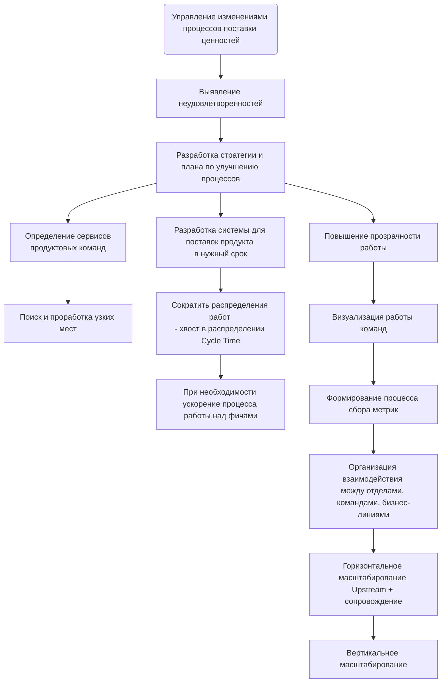
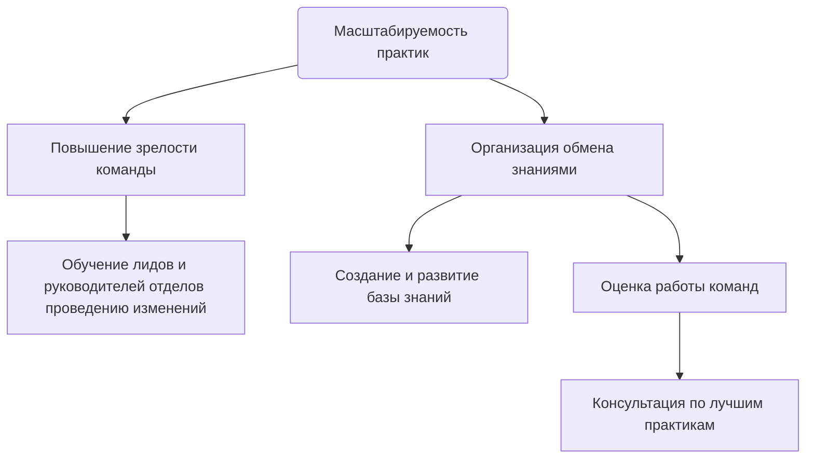

import Tabs from '@theme/Tabs';
import TabItem from '@theme/TabItem';

# Описание профессии Деливери менеджер
**Деливери менеджер (Delivery Manager)** — data-driven менеджер изменений, который отвечает за сквозной процесс доставки итогового продукта до пользователя: сокращает время от идеи до выхода продукта на рынок и увеличивает прогнозируемость. Если нет запроса на сквозной процесс — отвечает за всю доступную цепочку.

Не стоит сравнивать с такими профессиями, как Service Delivery Manager, Scrum Master или Agile Coach — даже по-отдельности они не характеризуют роль Delivery Manager.

## Зачем нужен
* Ускорять поставку продуктов на рынок в условиях растущей сложности ИТ систем, процессов и самих продуктов
* Пересобирать и улучшать процессы растущего или изменяющегося бизнеса, чтобы компании не теряли гибкость и эффективность при масштабировании
* Накапливать и делиться практиками и опытом с организацией, командами, сотрудниками, комьюнити

## Что делает
Задачи Деливери менеджера делятся на две группы: управление изменениями и масштабируемость практик.

<!-- [start] add this to avoid the possible bug. Note: the empty line before [```] is necessary -->
```mermaid
flowchart TD

```
<!-- [end] add this to avoid the possible bug -->

<Tabs>
<TabItem value="Управление изменениями" label="Управление изменениями">



</TabItem>
<TabItem value="Масштабируемость практик" label="Масштабируемость практик">



</TabItem>
</Tabs>

## Как делает
Чтобы выполнять свои задачи Деливери менеджер выступает в трех ролях — владелец производственного процесса, менеджер изменений и коуч.

**Владелец Продукта "Производственный процесс"** работает с доставкой продукта от идеи до получения продукта пользователем, выстраивает горизонтальные и вертикальные партнерские связи между всеми участниками создания ценности. Он визуализирует процессы, чтобы они были понятными и управляемыми, а еще работает над улучшением метрик Discovery и Delivery и формирует прозрачную стратегию планов развития производственных процессов с учетом целей компании.

**Агент изменений** управляет изменениями используя инструменты менеджмента, вовлекает людей в общее дело. Он масштабирует процессы и рабочие практики чтобы сохранить гибкость компании и работает с метриками, используя data-driven подход. Помогает командам поддерживать такой уровень осознанности, чтобы они могли самостоятельно улучшать процессы.

**Коуч** помогает командам решать конфликты и приходить к лучшим решениям с помощью инструментов фасилитации. Накапливает знания и практики, адаптирует под контекст и делится ими с коллегами. А еще коуч поддерживает в людях проактивную позицию участия в жизни компании и ее процессов, инвестирует в обучение и развитие через практики коучинга и менторинга. Помогает составлять индивидуальные планы развития специалистов и процессов.
