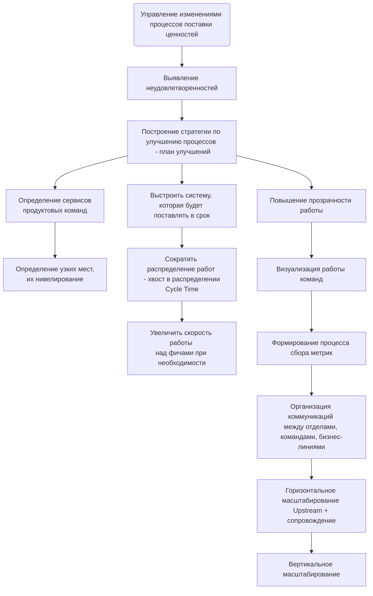
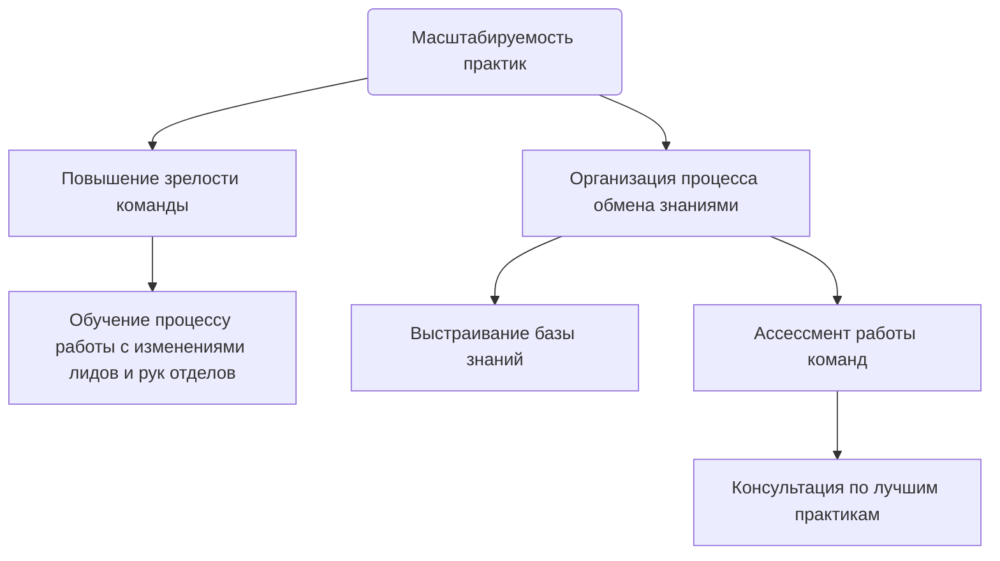

import Tabs from '@theme/Tabs';
import TabItem from '@theme/TabItem';

# Описание
Роль ***Delivery Manager*** – **data-driven менеджер изменений**, который отвечает за **выстраивание End-to-End процесса поставки ценности**: сокращает Time to market и увеличивает прогнозируемость. Там где нет запроса на сквозной процесс – отвечает за всю доступную цепочку.

Некорректно сравнивать со сложившимся на рынке профессиями, такими как Service Delivery Manager, Scrum Master или Agile Coach, так как по отдельности они не характеризуют роль Delivery Manager.

## Зачем нужен
* Помочь организации в условиях увеличивающейся сложности (IT-систем, продуктов, коммуникаций, процессов) ускорить поставку продуктов на рынок
* Также помочь организации не терять гибкость и эффективность при масштабировании: пересобирать и улучшать процессы под рост или реструктуризацию бизнеса
* Накапливать и делиться работающими практиками и опытом с организацией и её командами, сотрудниками, комьюнити

## Что делает
Условно задачи Delivery Manager можно разделить на 2 группы:

<!-- [start] add this to avoid the possible bug. Note: the empty line before [```] is necessary -->
```mermaid
flowchart TD

```
<!-- [end] add this to avoid the possible bug -->

<Tabs>
<TabItem value="Управление изменениями" label="Управление изменениями">



</TabItem>
<TabItem value="Масштабируемость практик" label="Масштабируемость практик">



</TabItem>
</Tabs>

## Как делает
Чтобы выполнять свои задачи Delivery Manager выступает в 3-х ролях.

| Владелец Продукта "Производственный процесс"                                                                                                                                                                                                                                                                                                                                                                                                                                                                                                                             | Агент изменений                                                                                                                                                                                                                                                                                                                                                                                                     | Коуч                                                                                                                                                                                                                                                                                                                                                                                                                                                                                                            |
|--------------------------------------------------------------------------------------------------------------------------------------------------------------------------------------------------------------------------------------------------------------------------------------------------------------------------------------------------------------------------------------------------------------------------------------------------------------------------------------------------------------------------------------------------------------------------|---------------------------------------------------------------------------------------------------------------------------------------------------------------------------------------------------------------------------------------------------------------------------------------------------------------------------------------------------------------------------------------------------------------------|-----------------------------------------------------------------------------------------------------------------------------------------------------------------------------------------------------------------------------------------------------------------------------------------------------------------------------------------------------------------------------------------------------------------------------------------------------------------------------------------------------------------|
| <ul><li>Работает с доставкой ценности на всём End-to-End процессе</li><li>Выстраивает вертикальные и горизонтальные партнёрские связи между всеми участниками доставки ценности</li><li>Визуализирует процессы, делая их понятными и управляемыми</li><li>Работает над улучшением метрик Discovery и Delivery, выстраивая прозрачные и измеримые отношения между продуктовыми, сервисными и бизнес-командами</li><li>Формирует понятную и прозрачную стратегию краткосрочных и долгосрочных планов развития производственных процессов с учётом целей компании</li></ul> | <ul><li>Управляет изменениями используя доступные практики менеджмента вовлекая людей в общее дело</li><li>Масштабирует процессы и рабочие практики для сохранения гибкости компании</li><li>Доводит команды до такого уровня осознанности, чтобы они могли самостоятельно, без помощи деливери-менеджера, улучшать процессы</li><li>Работает с метриками и принимая решения используя data-driven подход</li></ul> | <ul><li>Взращивает в людях проактивную позицию участия в жизни компании и её процессов</li><li>Инвестирует в обучение и развитие людей через практики коучинга, менторинга, фасилитации, супервизии и помощи им в составлении индивидуальных планов развития и развития процессов</li><li>Накапливает знания и практики, адаптирует их под контекст и делиться ими с коллегами</li><li>Помогает командам решать конфликты и быстрее приходить к наилучшим решениям, используя инструменты фасилитации</li></ul> |
