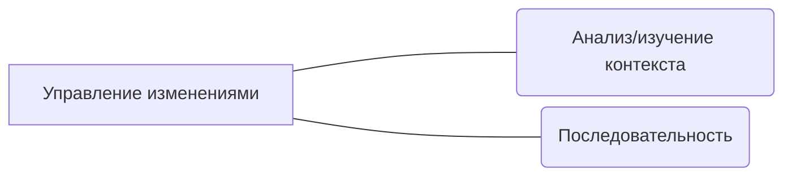

# Управление изменениями

```mermaid
graph LR
%%{ init: { 'flowchart': { 'nodeSpacing': 10, 'rankSpacing': 200 }}}%%
    A[Управление изменениями] --- B1(Анализ/изучение контекста) & B2(Последовательность)
```
