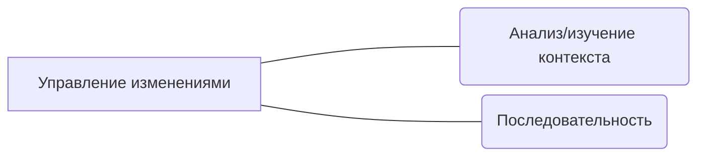

# Управление изменениями
Управление изменениями — это важный процесс, который позволяет контролировать изменения, чтобы достичь поставленных целей и улучшить эффективность. Может включать в себя внедрение новых систем, изменение бизнес-процессов, пересмотр организационной структуры и многое другое.

## О чём это направление
Важно понимать, что внесение изменений - это сложный процесс, который может как помочь, так и навредить. Поэтому очень важно провести **анализ контекста**, чтобы понять, какие изменения необходимо внести и как их внедрение повлияет на текущие процессы, людей и компанию в целом. Анализ контекста может включать в себя изучение текущего состояния, целей и задач, анализ внешней среды и т. д. Также важно изучить контекст, понять культуру, ценности и нормы поведения, чтобы определить, как изменения могут повлиять на сотрудников и как их можно подготовить к изменениям.

Другим важным аспектом управления изменениями является определение **последовательности изменений**. Это включает в себя планирование, разработку и реализацию изменений. Необходимо определить, какие изменения необходимо внести, кто будет ответственным за их внедрение и какие ресурсы потребуются для успешного завершения проекта. Важно понимать, что последовательность изменений может быть различной для разных организаций и проектов. Поэтому необходимо провести анализ и изучение контекста, чтобы определить наиболее эффективный подход к внедрению изменений.

Использование инструментов управления изменениями, таких как анализ и изучение контекста, а также определение последовательности изменений, помогает гарантировать успешное внедрение изменений и достижение поставленных целей. Не бойтесь вносить изменения, но не забывайте о необходимости правильного управления ими.

## Почему важно работать с этим направлением
* Управление изменениями требуют системного подхода и знаний инструментов и методик. В противном случае могут возникнуть непредсказуемые проблемы, а результат будет далек от ожидаемого

## Дополнительные материалы
* [Книги, видео, подкасты](/docs/profession/good-to-know#управление-изменениями)
* [Анти-паттерны](/docs/profession/antipatterns)
