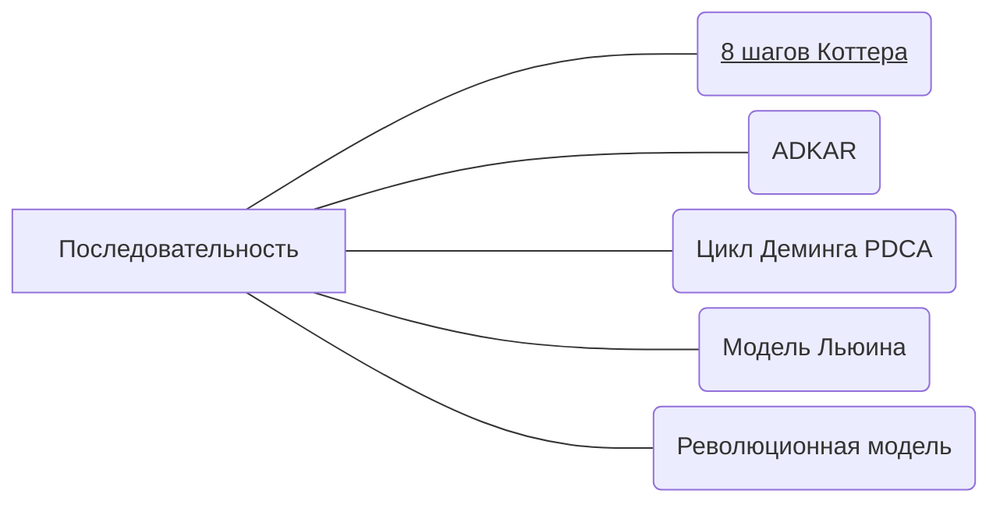

# Последовательность
## Инструменты
Для определения последовательности изменений можно использовать различные модели. Далее расскажем, как выбрать подходящую, а на странице каждой из этих моделей раскрываем наши советы по их реализации.

## Как выбрать
Для выбора подходящей нужно понимать цели организации, ее культуру и структуру, а также готовность сотрудников к изменениям.

Если прямо здесь и сейчас давать какой-то совет, то он звучит так: PDCA и ADKAR подходят для небольших изменений, требующих изменения поведения, в то время как 8-ступенчатая модель Коттера и модель Льюина лучше всего подходят для крупномасштабных изменений, которые требуют культурного изменения. А если хочется создать культуру непрерывного улучшения и инноваций, то подойдет эволюционная модель.

Но важно внимательно оценить каждую модель, чтобы определить, какая из них лучше всего подойдет для вашей организации. В этом процессе таблица сравнения разных моделей изменений может оказаться полезной, чтобы понять их плюсы и минусы.

### ADKAR и Kotter

| Параметр                  | Модель Коттера                                               | Модель ADKAR                                            |
|---------------------------|--------------------------------------------------------------|---------------------------------------------------------|
| Количество этапов         | 8                                                            | 5                                                       |
| Ориентация                | Большие, сложные изменения                                   | Меньшие, более простые изменения                        |
| Фокус                     | Мотивация сотрудников                                        | Изменение поведения сотрудников                         |
| Последовательность этапов | Действия выполняются последовательно                         | Действия выполняются одновременно или в параллели       |
| Результат                 | Постоянное изменение культуры и структуры организации        | Постоянное изменение поведения сотрудников              |
| Ключевой фактор успеха    | Мотивация и лидерство                                        | Коммуникация и обучение                                 |
| Недостатки                | Медленная реализация, не всегда подходит для малых изменений | Не уделяется достаточного внимания культуре организации |

Как видно из таблицы, обе модели имеют свои преимущества и недостатки. Модель Коттера ориентирована на более крупные и сложные изменения, а модель ADKAR - на более простые и меньшие изменения. Модель Коттера предполагает последовательное выполнение этапов, в то время как модель ADKAR предлагает выполнение действий одновременно или в параллели. Ключевыми факторами успеха в модели Коттера являются мотивация и лидерство, а в модели ADKAR - коммуникация и обучение.

### Революционная и эволюционная модель

| Категории           | Революционная модель                              | Эволюционная модель                                           |
|---------------------|---------------------------------------------------|---------------------------------------------------------------|
| Философия           | Большой, глобальный и быстрый прыжок вперед       | Медленное, но постоянное движение вперед                      |
| Подход к изменениям | Радикальное пересмотрение                         | Инкрементальное улучшение                                     |
| Сфера применения    | Масштабные преобразования в организации и бизнесе | Непрерывное улучшение внутренних процессов                    |
| Тип лидерства       | Руководитель как главный двигатель изменений      | Руководитель как координатор изменений                        |
| Роль сотрудников    | Участие в революционных изменениях                | Участие в улучшении текущих процессов                         |
| Риски и сложности   | Большой риск и высокие затраты на реализацию      | Медленный прогресс и слабое привлечение внимания к изменениям |

Как видно из таблицы, революционная модель изменений направлена на быстрое и радикальное пересмотрение текущего состояния организации и ее бизнес-модели, что может привести к значительным результатам в короткие сроки. Однако, это также связано с большими рисками и высокими затратами на реализацию изменений.

С другой стороны, эволюционная модель изменений более ориентирована на непрерывное улучшение текущих процессов в организации. Это позволяет достигать результатов более медленно, но с меньшими затратами и рисками. Также эта модель более доступна для многих организаций, так как не требует крупномасштабных изменений в короткие сроки.

Обе модели имеют свои сильные и слабые стороны, и выбор конкретной модели зависит от целей, ситуации в организации и ее культуры.

### Общие выводы

Так или иначе все модели укладываются в три этапа

**Поиск мотивации или стрессора к изменениям:**
- Анализ текущего состояния и поиск проблемных областей (Коттер, АДКАР, Революционная модель)
- Оценка степени готовности сотрудников к изменениям (Коттер, АДКАР, Революционная модель)
- Выявление базовых причин сопротивления изменениям (Коттер, АДКАР, Революционная модель)

**Рефлексия:**
- Определение целей и планирование изменений (Коттер, АДКАР, Эволюционная модель)
- Разработка стратегии изменений (Коттер, АДКАР, Эволюционная модель)
- Построение коммуникационной стратегии (Коттер, АДКАР, Эволюционная модель)

**Совершение акта лидерства:**
- Реализация изменений (Коттер, АДКАР, Эволюционная модель)
- Поддержка новых методов работы (Коттер, АДКАР, Эволюционная модель)
- Оценка результатов и корректировка стратегии изменений (Коттер, АДКАР, Эволюционная модель)
