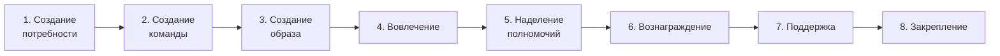

# Восемь шагов Коттера
Скорее всего самая популярная модель, используемая при проведении изменений. Существуют 2 версии:
1. **8 шагов Коттера.** Предложена в 1995 г. и представлена последовательными шагами
2. **8 ускорителей Коттера.** Переработанная в 2014 г. первая версия, в которой шаги превратились в ускорители

## Применимость
В первую очередь модель нацелена на реализацию изменений в организациях. По модели ситуативного лидерства Херси и Бланшара относится к _Стилю участия_. То есть лидер делится своим мыслями, вовлекает их в процесс и тем самым проводит изменения снизу-вверх. В базовом варианте можно применять и к командам.

## Дополнительные материалы
* [Книги, видео, подкасты](/docs/profession/good-to-know#8-шагов-коттера)
