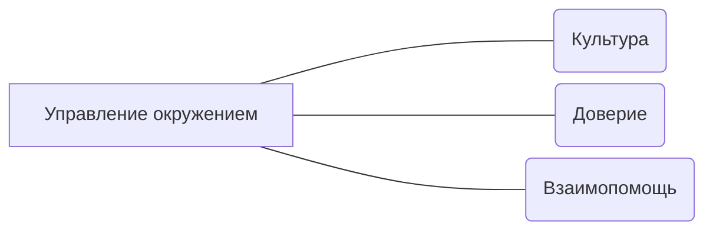

# Управление окружением

```mermaid
graph LR
%%{ init: { 'flowchart': { 'nodeSpacing': 10, 'rankSpacing': 200 }}}%%
    A[Управление окружением] --- B1(Культура) & B2(Доверие) & B3(Взаимопомощь)
```
