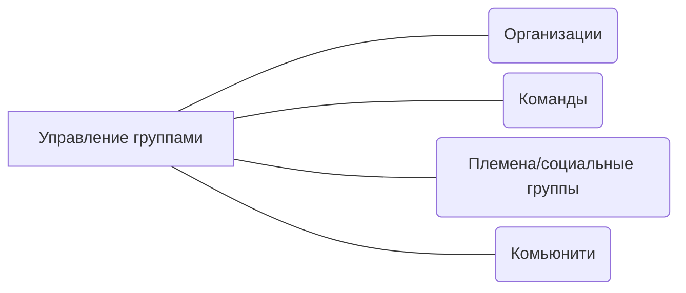

# Управление группами
Когда в вашей зоне влияния становится более 1 человека, то вы начинаете работать с некоторыми группами людей. Это может быть команда, целая организация (отдел, департамент, сквад, трайб и прочее), а может не то и не другое.

## О чём это направление

Здесь собраны инструменты, которые во-первых помогут идентифицировать группу в вашей зоне влияния, а во-вторых правильно с ней работать.

## Почему важно работать с этим направлением

* Работа с группами может оказаться как более сложной, так и более интересной, чем работа с одним человеком. Когда вы имеете дело с группой, появляются взаимосвязи и зависимости, которых нет в случае работы с одним человеком. Поэтому важно научиться правильно взаимодействовать с группами.
* Люди в группах часто ведут себя по-другому, чем в одиночку. Это связано с различными факторами, такими как социальная динамика, влияние других людей на поведение, принятие решений в группе и т.д. Понимание причин такого поведения и умение правильно с этим работать - крайне важно. 
* Также важно понимать, что инструменты, которые хорошо себя зарекомендовали в работе с одним человеком, могут не сработать с группой, состоящей из нескольких человек. Каждый инструмент имеет свою применимость, и его нужно уметь правильно использовать в зависимости от ситуации.

## Дополнительные материалы
* [Анти-паттерны](/docs/profession/antipatterns)
