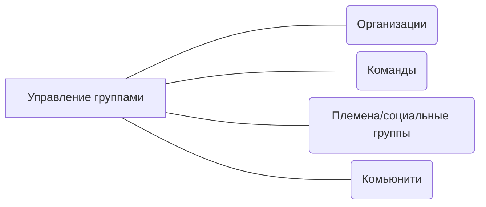

# Управление группами
Когда в вашей зоне влияния становится более 1 человека, то вы начинаете работать с некоторыми группами людей. Это может быть команда, целая организация (отдел, департамент, сквад, трайб и прочее), а может не то и не другое.

## О чём это направление

Здесь собраны инструменты, которые во-первых помогут идентифицировать группу в вашей зоне влияния, а во-вторых правильно с ней работать.

## Почему важно работать с этим направлением

1. В отличии от работы с 1 человеком у групп появляются взаимосвязи и зависимости. С ними очень важно правильно работать
2. Люди в группах часто ведут себя по-другому, чем по одиночке. Понимать причины такого поведения и правильно с этим работать - крайне ценно
3. Почти у каждого инструмента есть своя применимость. Инструмент хорошо себя показавший себя в работе с 1 человеком, может плохо сработать с группой, состоящей из 3 человек

## Риски работы с этим направлением и анти-паттерны

- Всегда велик соблазн запустить что-то в одной команде, что сработало в другой. Масштабирование практик или чего-либо сложный процесс, требующий серьезной проработки
- Резкая смена объемов вашего влияния может быть крайне трудной. Лучше двигаться поступательно и после работы с 1 командой, брать 2-3, а не целый департамент из 10
