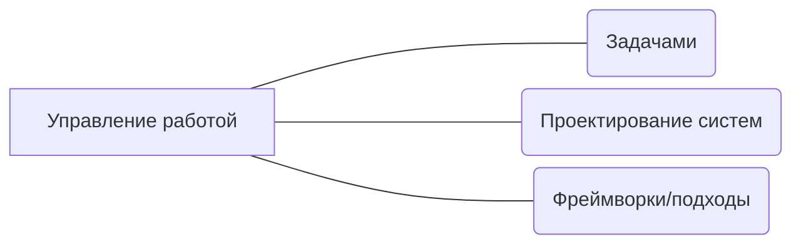

# Управление работой

## О чём это направление

## Почему важно работать с этим направлением

## Дополнительные материалы
* [Книги, видео, подкасты](/docs/profession/good-to-know#управление-работой)
* [Анти-паттерны](/docs/profession/antipatterns)
