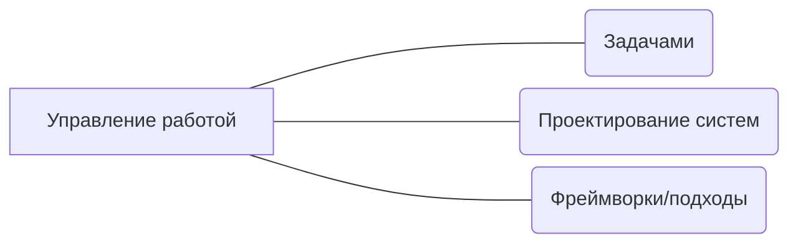

# Управление работой

```mermaid
graph LR
%%{ init: { 'flowchart': { 'nodeSpacing': 10, 'rankSpacing': 200 }}}%%
    A[Управление работой] --- B1(Задачами) & B2(Проектирование систем) & B3(Фреймворки/подходы)
```
