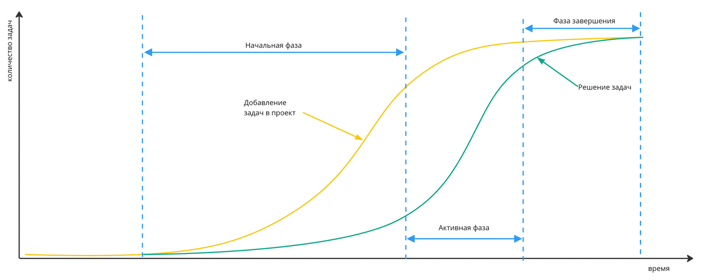

import MonteCarloThroughput from './assets/Monte-Carlo-Throughput.png';
import MonteCarloBurndownChart from './assets/Monte-Carlo-Burndown-chart.jpg';
import MonteCarloBurndownChartFull from './assets/Monte-Carlo-Burndown-chart-full.jpg';
import MonteCarloAllExperiments from './assets/Monte-carlo-all-experiments.png';
import MonteCarloResultProbably from './assets/Monte-Carlo-Result-Probably.png';
import MonteCarloWithRisk from  './assets/Monte-Carlo-with-risks.png';
import styles from './assets/monte-carlo-method.module.css';

# Метод Монте-Карло

:::note
Для начала введем термины:
* **Модель расчёта** — функция или система функций и выбранный порядок их расчёта
* **Опыт** — эксперимент, одна из проб расчёта по выбранной модели и получения результата
* **Исход** — это результат проведенного опыта
* **Событие** — явление, которое может произойти или не произойти в результате опыта, при сопоставлении предполагаемого результата с фактическим наблюдением
* **Свертка данных** — это приведение нескольких значений к одному, например выбрать "среднее" или "медиану" или другие математические операции, позволяющие дать характеристику набору данных в одном значении.
* **Волатильность** — изменчивость данных измеряемой величены
:::

Метод <nobr>Монте-Карло</nobr> представляет собой перебор возможных исходов событий. А для его использования в планировании необходимо сначала выбрать модель по которой будет производиться расчет.

Для понимания того как работает метод используем его для решения задачи "прогнозирования сроков завершения проекта интеллектуальной работы".

:::info
Есть важное замечание при использовании метода в ИТ!

Когда мы говорим о прогнозировании сроков ИТ команды лучшим отрезком свертки данных по пропускной способности будет является неделя. 
Свзяано это с тем, что количество задач выполненных за день будет сильно изменятся от дня ко дню, по причине высокой волатильности результатов зависящих как от эмоционального состояния людей, так и разной сложности решаемых задач и многих других параметров.
:::

## Прогнозирования сроков завершения проекта на основе пропускной способности

Для примера необходимо взять достаточный набор данных, предлагаю использовать периоды от 7 до 26 недель. С чем может быть связано?
7 недель, это чуть более чем полтора месяца, меньше данных для использования метода <nobr>Монте-Карло</nobr> приведет высокой степени недостоверности результата.
А брать более чем 26 недель, что соответствует половине года, не имеет смысла, так как в интеллектуальной работе происходят постоянные изменения, которые так же могут внести повысить недостоверность прогнозов. С другой стороны такого набора данных вполне достаточно для хорошего прогнозирования.

Будет ли работать метод, с учетом того, что интеллектуальные задачи очень разные по сложности и времени выполнения?
Да, конечно будет. Главное чтобы объемы этих задач не отличались кратно. Например если в наборе данных мы имеем задачу которую можно решить в течении пары часов и задачу которую будут решать более 120 дней, то это может привести к недостоверности результата прогнозирования внося огромную дисперсию в результат.
По этому рекомендуется использовать декомпозицию задач, которые будут нивелировать огромный разрыв в характеристиках поставленных заданий.

### Постановка задачи для примера

И так рассмотрим пример прогнозирования сроков выполнения проекта, который декомпозирован на 40 задач.

Есть набор данных в виде количества завершенных задач суммированных понедельно — это данные пропускной способности “Throughput”:

```
[4, 1, 2, 1, 4, 3, 2, 3, 6, 3, 2, 1, 6, 13, 3, 1, 6, 1, 4, 4, 6, 3, 6, 2, 6, 2]
```

Каждое число в этом наборе — это количество задач завершенных за одну неделю. Общее количество данных мы взяли за последние 26 неделю.


### Алгоритм метода

#### Шаг первый

Выбираем случайное число из набора данных пропускной способности.

Например, 8 число из набора. Это будет "3"

```
[4, 1, 2, 1, 4, 3, 2, |3|, 6, 3, 2, 1, 6, 13, 3, 1, 6, 1, 4, 4, 6, 3, 6, 2, 6, 2] → 3
```
#### Шаг второй

Считаем что в первую неделю работы над проектом сервис выполнит 3 задачи. И от 40 исходных задач проекта отнимаем это же количество, получим 37.


#### Шаг третий

Повторяем первый шаг, и второй до тех пор, пока в исходном наборе 40 задач проекта не останется их совсем. Так мы получим вероятное количество недель за которое будет выполнен проект, запоминаем это количество недель. А добавив этот отрезок времени к планируемой дате начала проекта, можем получить дату завершения.


На примере просчета первого эксперимента (на картинке), проект завершится за 17 недель. Запоминаем этот срок.

#### Шаг четвертый

Алгоритм шагов от первого до третьего повторяем от 10000. После каждого расчета сроков, мы получим число недель за которое может закрыться проект. Собираем эти сроки и считаем сколько раз проект закрылся за этот срок.


Так получаем распределение данных показывающих за какое количество недель может быть выполнен проект, и какое количество исходов получилось при моделировании в одно и тоже количество недель.

<table>
<tr className={styles.noWrap}>
<th>Количество недель</th>
    <td>5</td><td>6</td><td>7</td><td>8</td><td>9</td><td>10</td><td>11</td><td>12</td><td>13</td>
    <td>14</td><td>15</td><td>16</td><td>17</td><td>18</td><td>19</td><td>20</td><td>21</td><td>22</td>
</tr>
<tr className={styles.vertical}>
<th>Количество исходов</th>
    <td>7</td><td>41</td><td>153</td><td>320</td><td>654</td><td>1070</td><td>1420</td><td>1664</td><td>1631</td>
    <td>1226</td><td>911</td><td>541</td><td>215</td><td>97</td><td>25</td><td>10</td><td>3</td><td>2</td>
</tr>
</table>


Для каждой недели имеем количество раз, сколько раз завершился проект в эту неделю.

Используя эти данные мы можем рассчитать вероятность завершения проекта к каждой неделе в которую он завершился.

По формуле 
$$
P = \dfrac{\sum_{n=1}^{10000} s}{N}
$$

где s — количество исходов на текущей неделе. Т.е. сумма общих исходов до текущей даты, делённая на N —количество экспериментов, в рассматриваемом случае это 10000.

<table>
<tr className={styles.noWrap}>
<th>Количество недель</th>
    <td>5</td><td>6</td><td>7</td><td>8</td><td>9</td><td>10</td><td>11</td><td>12</td><td>13</td>
    <td>14</td><td>15</td><td>16</td><td>17</td><td>18</td><td>19</td><td>20</td><td>21</td><td>22</td>
</tr>
<tr className={styles.vertical}>
<th>Количество исходов "s"</th>
    <td>7</td><td>41</td><td>153</td><td>320</td><td>654</td><td>1070</td><td>1420</td><td>1664</td><td>1631</td>
    <td>1226</td><td>911</td><td>541</td><td>215</td><td>97</td><td>25</td><td>10</td><td>3</td><td>2</td>
</tr>
<tr className={styles.vertical}>
<th>Вероятность "P"</th>
    <td>0.0007</td><td>0.0048</td><td>0.0201</td><td>0.0521</td><td>0.1175</td><td>0.2245</td><td>0.3665</td><td>0.5329</td><td>0.696</td>
    <td>0.8196</td><td>0.9107</td><td>0.9648</td><td>0.9863</td><td>0.996</td><td>0.9985</td><td>0.9995</td><td>0.9998</td><td>1</td>
</tr>
</table>

Можем увидеть, что количественная вероятность завершить проект в 15 неделю уже превышает 90%, а на 16 уже превысить 95%.

Выбрав удовлетворяющую вас вероятность завершения проекта, вы определяете и срок завершения.

Из опыта, хорошей вероятностью для интеллектуальной работы является вероятность в пределах от 85% до 98%.

Если отобразить этот результат на графике, то получим следующее


В данном случае можно взять в качестве сроков выполнения проекта **16 неделю**, где вероятность завершения проекта равна `0.9648`,
что соответствует **96.48%**.

### Алгоритм метода на JavaScript

<details>
  <summary>Вот пример кода на JavaScript для этой простой модуляции.</summary>
  <div>

```javascript
// Данные по пропускной способности по итерациям времени
// итерация - минимальная единица времени в которой хотим считать
// длительность проекта
const historicalDataThroughput = [
    4, 1, 2, 1, 4, 3, 2, 3, 2, 3, 6,
    3, 2, 1, 6, 13, 3, 1, 6, 1, 2,
    4, 4, 6, 3, 1, 3, 3, 6, 6, 2,
    6, 2, 1
  ];
  
  // количество задач в проекте
  const countTaskInProject = 40;
  const result = MonteCarloForProject(historicalDataThroughput, countTaskInProject, 10000);
  console.table(result)
 
  /**
   * Получить распределение вероятности завершения проекта
   * на основе количества решаемых задач за итерацию
   * 
   * @param {Array<Number>} historicalDataThroughput Набор испторических данных по пропускной способности
   * @param {Number} countTaskInProject Количество задач в проекте
   * @param {Number} numberOfExperiments Количество проводимх эксперимантов
   * @returns {Array<Number, Number>} key - количество фич в итерации, value - частота
   */
  function MonteCarloForProject(
    historicalDataThroughput,
    countTaskInProject,
    numberOfExperiments
  ) {
    const result = new Map();
    const len = historicalDataThroughput.length
    let experiment = 1;
    
    for (; experiment <= numberOfExperiments; experiment++) {
      let prjTasks = countTaskInProject;
      // индекс начинается с "0"
      let IndexIteration = 0;
      while (prjTasks > 0) {
        let randomIndex = Math.floor(Math.random() * len);
        let countTasks = historicalDataThroughput[randomIndex];
        IndexIteration += 1;
        prjTasks = prjTasks - countTasks;
      }
  
      let i = result.get(IndexIteration);
      result.set(IndexIteration, i ? i + 1 : 1);
    }
    let sum = 0;
    // Из Map переводим в тип Массив, расчитываем вероятность
    return Array.from(result, ([name, value]) => ({ iteration: name, count: value}))
      .sort((a, b) => a.iteration - b.iteration)
      .map((i,j) => {
          sum += i.count;
          return {
              ...i,
              probability: sum/numberOfExperiments
          }
      })
  }
```

 
  </div>
</details>

[Пример на Gist Github](https://gist.github.com/pavelpower/97625088b6cdbde9cfdd4f181fb33a39)

Код написан так, чтобы можно было его запустить в браузере.


<details>
  <summary>Пример вывода результата программы:</summary>
  <div>

```
┌─────────┬───────────┬───────┬─────────────┐
│ (index) │ iteration │ count │ probability │
├─────────┼───────────┼───────┼─────────────┤
│    0    │     4     │   1   │   0.0001    │
│    1    │     5     │  11   │   0.0012    │
│    2    │     6     │  51   │   0.0063    │
│    3    │     7     │  125  │   0.0188    │
│    4    │     8     │  341  │   0.0529    │
│    5    │     9     │  646  │   0.1175    │
│    6    │    10     │ 1087  │   0.2262    │
│    7    │    11     │ 1492  │   0.3754    │
│    8    │    12     │ 1630  │   0.5384    │
│    9    │    13     │ 1528  │   0.6912    │
│   10    │    14     │ 1289  │   0.8201    │
│   11    │    15     │  892  │   0.9093    │
│   12    │    16     │  515  │   0.9608    │
│   13    │    17     │  242  │    0.985    │
│   14    │    18     │  96   │   0.9946    │
│   15    │    19     │  37   │   0.9983    │
│   16    │    20     │  13   │   0.9996    │
│   17    │    21     │   3   │   0.9999    │
│   18    │    22     │   1   │      1      │
└─────────┴───────────┴───────┴─────────────┘
```

  </div>
</details>

Где 

* **iteration** — это количество недель (итераций) которое понадобится на реализацию проекта из **40** задач
* **count** — количество исходов, результатов завершения проекта за этот срок из заданных **10000** повторений
* **probability** — рассчитанная количественная вероятность завершения за этот срок

### Можно ли в модели учесть неожиданные события?

Да, вполне! Вы так же можете учесть возможные риски которые могут случится с какой-то вероятностью.

Для этого добавим функциональность, которая в зависимости от наступления риска добавялет некое количество задач, указанное в пределах
от минимального до максимального количества возможных для этого риска.

Нам нужно определить заранее предполагаемую вероятность наступления риска, и предположить сколько задач он может добавить или убрать какое-то количество.


### Алгоритм метода на JavaScript с учетом рисков

<details>
  <summary>Алгоритм метода на JavaScript с учетом рисков</summary>
  <div>

```javascript
// Данные по пропускной способности по итерациям времени
// итерация - минимальная единица времени в которой хотим считать
// длительность проекта
const historicalDataThroughput = [
  4, 1, 2, 1, 4, 3, 2, 3, 2, 3, 6,
  3, 2, 1, 6, 13, 3, 1, 6, 1, 2,
  4, 4, 6, 3, 1, 3, 3, 6, 6, 2,
  6, 2, 1
];

// количество задач в проекте
const countTaskInProject = 40;

// Риски которые могут случится с какой-то вероятностью
// И добавить новых задач к проекту
// Предполагаем что риск может сработать один раз
const risks = [
  // С вероятностью "probability" наступления риска, к проекту добавится от "min" до "max" задач
  { probability: 2, countTask: { min: 10, max: 15 } },
  { probability: 12, countTask: { min: 2, max: 20 } },
  { probability: 5, countTask: { min: 5, max: 12 } },
  { probability: 4, countTask: { min: -8, max: -2 } },
]

// Выполнить функцию Монте-Карло и получить результат
const result = MonteCarloForProject(
  historicalDataThroughput,
  countTaskInProject,
  risks,
  10000
);

// Показать результат в консоли
console.table(result);

/**
 * Получить распределение вероятности завершения проекта
 * на основе количества решаемых задач за итерацию
 *
 * @param {Array<Number>} historicalDataThroughput Набор испторических данных по пропускной способности
 * @param {Number} countTaskInProject Количество задач в проекте
 * @param {Array<{probability: Number, countNewTasks: Number}>} risks Риски
 * @param {Number} numberOfExperiments Количество проводимх эксперимантов
 * @returns {Array<Number, Number>} key - количество фич в итерации, value - частота
 */
function MonteCarloForProject(
  historicalDataThroughput,
  countTaskInProject,
  risks,
  numberOfExperiments
) {
  const result = new Map();
  const len = historicalDataThroughput.length
  let experiment = 1;

  for (; experiment <= numberOfExperiments; experiment++) {
    let prjTasks = countTaskInProject;

    // Перебираем все риски
    risks.forEach(r => {
      let randomForRisk = getRandomBetween(1, 100);

      // Если сгенерированное число меньше чем указанный процент вероятности,
      // считаем что риск случился
      if (r.probability > randomForRisk) {
        // Выбираем случайное количество задач между min и max указанное в риске
        let countTasks = getRandomBetween(r.min, r.max);
        // Добавялем их к проекту
        prjTasks += countTasks;
      }
    });

    let IndexIteration = 0;
    while (prjTasks > 0) {
      // Выбираем случайное число из набора Throughput
      let randomIndex = Math.floor(Math.random() * len);
      // Получаем какое количество задач нужно отнять в эту неделю
      let countTasks = historicalDataThroughput[randomIndex];
      // Отнимаем это количество задач
      prjTasks = prjTasks - countTasks;
      // Переходим к следующей итерации
      IndexIteration += 1;
    }

    // Фиксируем какая итерация получилась
    let i = result.get(IndexIteration);
    result.set(IndexIteration, i ? i + 1 : 1);
  }
  let sum = 0;
  // Готовим данные к показу результата
  return Array.from(result, ([name, value]) => ({ iteration: name, count: value }))
    .sort((a, b) => a.iteration - b.iteration)
    .map((i) => {
      sum += i.count;
      return {
        ...i,
        probability: sum / numberOfExperiments
      }
    })
}

function getRandomBetween(min, max) {
  return Math.floor(Math.random() * (max - min + 1)) + min;
}
```
</div>
</details>

[Пример на Gist Github](https://gist.github.com/pavelpower/4c22b470f1e78030802963d61ae6b8e1)

Код написан так, чтобы можно было его запустить в браузере.

<details>
  <summary>Пример вывода результата программы:</summary>
  <div>


```
┌─────────┬───────────┬───────┬─────────────┐
│ (index) │ iteration │ count │ probability │
├─────────┼───────────┼───────┼─────────────┤
│    0    │     0     │ 1789  │   0.1789    │
│    1    │     4     │   1   │    0.179    │
│    2    │     5     │   9   │   0.1799    │
│    3    │     6     │  31   │    0.183    │
│    4    │     7     │  103  │   0.1933    │
│    5    │     8     │  272  │   0.2205    │
│    6    │     9     │  554  │   0.2759    │
│    7    │    10     │  866  │   0.3625    │
│    8    │    11     │ 1149  │   0.4774    │
│    9    │    12     │ 1335  │   0.6109    │
│   10    │    13     │ 1375  │   0.7484    │
│   11    │    14     │ 1031  │   0.8515    │
│   12    │    15     │  711  │   0.9226    │
│   13    │    16     │  422  │   0.9648    │
│   14    │    17     │  208  │   0.9856    │
│   15    │    18     │  91   │   0.9947    │
│   16    │    19     │  37   │   0.9984    │
│   17    │    20     │  14   │   0.9998    │
│   18    │    21     │   2   │      1      │
└─────────┴───────────┴───────┴─────────────┘
```
</div>
</details>

Модель расчетов можно расширять разными способами, и учитывать некоторые особенности реализации проектов в зависимости от контекста.

А суть метода останется прежней:
1. Наблюдаем
2. Берем исторические данные
3. Формулируем модель расчета "выгорания" проекта
4. На основе этих данных используем выбор случайной величины из набора
5. Вычитаем из проекта количество равное случайной величине, до тех пор, пока не закончатся "очки" проекта
6. Фиксируем в памяти срок за который закрылся проект
7. Повторяем алгоритм много раз
8. Смотрим сколько раз завершался проект за какой срок

## Выводы
Даже используя простую модель расчета, вы можете при помощи метода <nobr>Монте-Карло,</nobr> определить вероятность завершения проекта.

И такая вероятность будет достаточно точной, с учетом того, что ваша система (процессы создания ценности) не изменялись со временем.

Хотя, вы уже понимаете, что моделировать при помощи <nobr>Монте-Крало</nobr> можно и более сложные модели, в том, числе и с учетом предполагаемых изменений. Но надо иметь ввиду, что изменения вводимые в процессы очень сложно прогнозируются, и вы можете построить ошибочную модель.

Мир математики численных методов куда более широк, чем изложен в этой статье. Чего только стоят [Байесовские методы](https://ru.wikipedia.org/wiki/%D0%91%D0%B0%D0%B9%D0%B5%D1%81%D0%BE%D0%B2%D1%81%D0%BA%D0%B0%D1%8F_%D1%81%D1%82%D0%B0%D1%82%D0%B8%D1%81%D1%82%D0%B8%D0%BA%D0%B0), которые могли бы вам помочь в моделировании более сложных процессов.

Начинайте с простого.

Если же вы плохо понимаете в коде, то могу предложить посмотреть проект созданный Rodrigo Rosauro на основе работ Troy Magennis и Dimitar Bakardzhiev's вот в этой Excel 

Попробуйте воспользоваться этой страницей https://rodrigozr.github.io/ProjectForecaster/

Для тех кто пользуется Jira, есть специальный плагин для Chrome [Jira Flow Companion](https://chrome.google.com/webstore/detail/jira-flow-companion/kbppfmkmcilakibigimbnohnbefifaao). В нем уже встроен модуль <nobr>Монте-Карло.</nobr> Хоть он и очень простой, но для большинства задач, его будет достаточно.


:::note
#### Примечание
Проекты, на самом деле завершаются не так линейно как показано в этих примерах. Они могут так завершатся только в одном случае, если команда занимается только этим проектом. Однако часто это не так.

Если исследовать динамику завершения проектов, часто можно обнаружить S-образную функцию (s-curve) завершения проекта, связанную с тем, что в начале проекта неизвестно до конца сколько будет добавлено задач к проекту.


:::

[© controlchart](https://t.me/controlcharts)