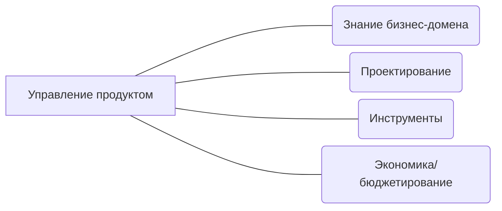

# Управление продуктом

```mermaid
graph LR
%%{ init: { 'flowchart': { 'nodeSpacing': 10, 'rankSpacing': 200 }}}%%
    A[Управление продуктом] --- B1(Знание бизнес-домена) & B2(Проектирование) & B3(Инструменты) & B4(Экономика/бюджетирование)
```
