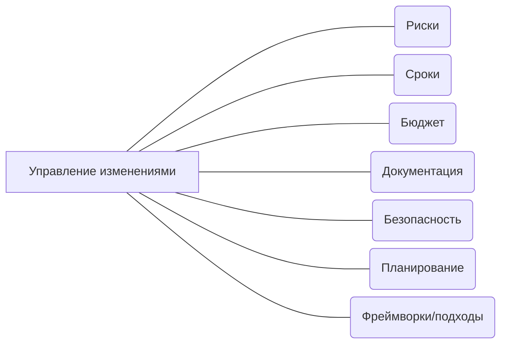

# Управление проектами

```mermaid
graph LR
%%{ init: { 'flowchart': { 'nodeSpacing': 10, 'rankSpacing': 200 }}}%%
    A[Управление изменениями] --- B1(Риски) & B2(Сроки) & B3(Бюджет) & B4(Документация) & B5(Безопасность) & B6(Планирование) & B7(Фреймворки/подходы)
```
