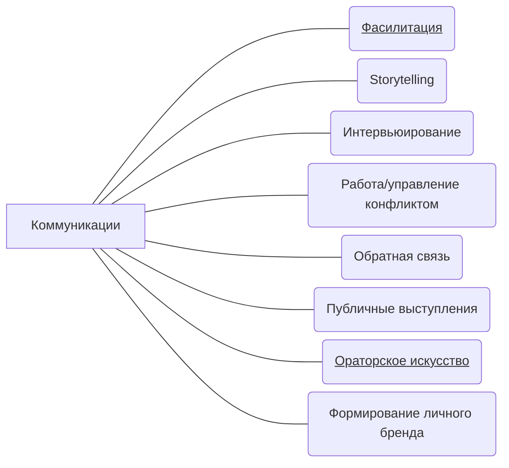

# Коммуникации

```mermaid
graph LR
%%{ init: { 'flowchart': { 'nodeSpacing': 10, 'rankSpacing': 200 }}}%%
    A[Коммуникации] --- B1(Фасилитация) & B2(Storytelling) & B3(Интервьюирование) & B4(Работа/управление конфликтом) & B5(Обратная связь) & B6(Публичные выступления) & B7(Ораторское искусство) & B8(Формирование личного бренда)
    click B1 "communications/facilitation" _blank
    click B7 "communications/oratory" _blank
    classDef label-link text-decoration: underline;
    class B1,B7 label-link
```
