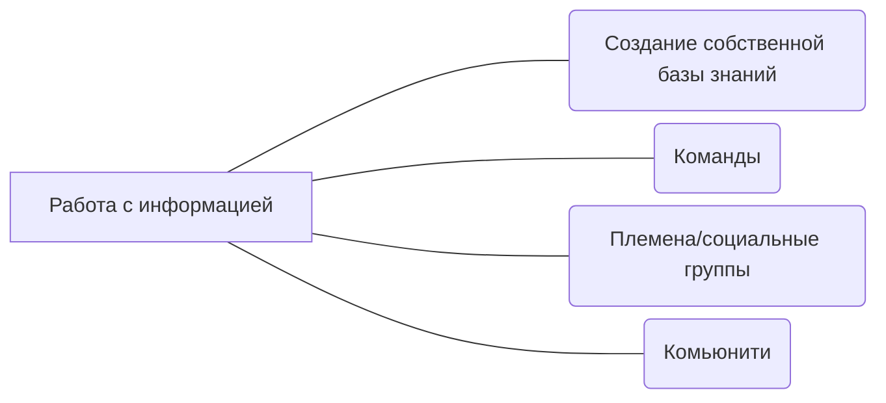

# Работа с информацией

```mermaid
graph LR
%%{ init: { 'flowchart': { 'nodeSpacing': 10, 'rankSpacing': 200 }}}%%
    A[Работа с информацией] --- B1(Создание собственной базы знаний) & B2(Команды) & B3(Племена/социальные группы) & B4(Комьюнити)
```
