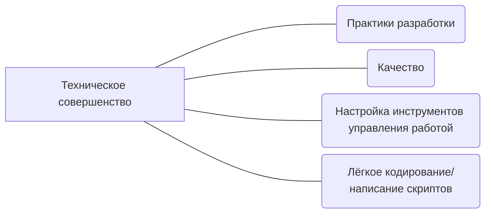

# Техническое совершенство

```mermaid
graph LR
%%{ init: { 'flowchart': { 'nodeSpacing': 10, 'rankSpacing': 200 }}}%%
    A[Техническое совершенство] --- B1(Практики разработки) & B2(Качество) & B3(Настройка инструментов управления работой) & B4(Лёгкое кодирование/написание скриптов)
```
